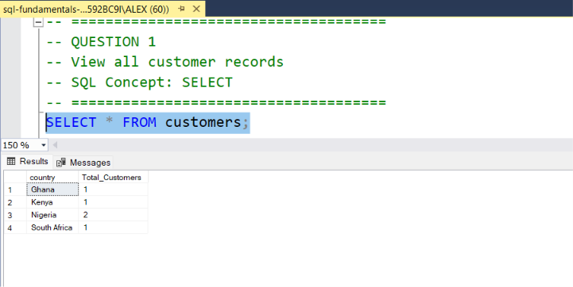
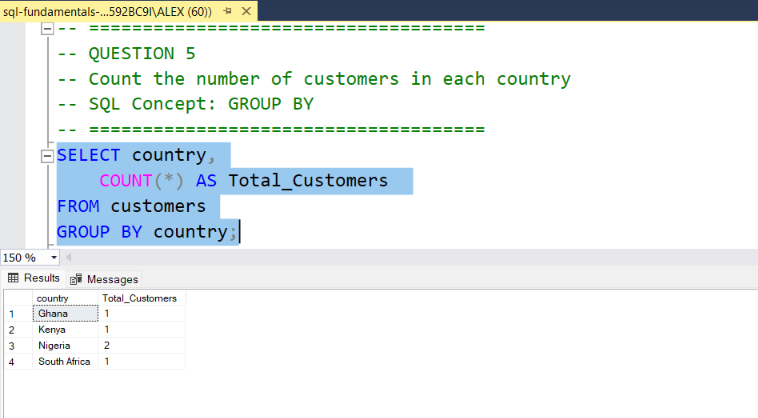
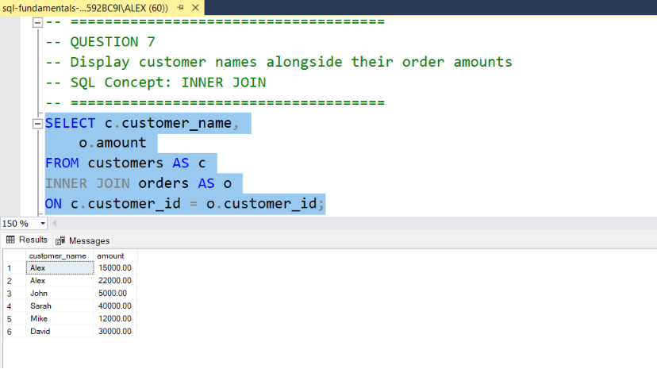
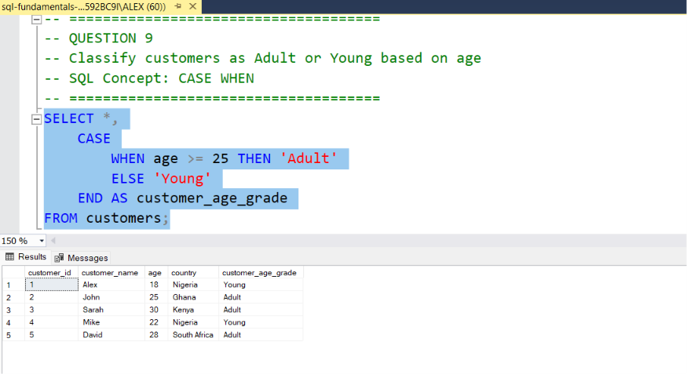

# SQL Fundamentals Practice

This repository contains a collection of SQL practice exercises completed using Microsoft SQL Server Management Studio (SSMS).

## Topics Covered

- SELECT
- WHERE
- ORDER BY
- BETWEEN
- GROUP BY
- HAVING
- INNER JOIN
- LEFT JOIN
- CASE WHEN

## Database Structure

The practice database contains three tables:

- customers
- orders
- logins

The SQL script includes:

- Database creation
- Table creation
- Sample data insertion
- Query exercises and solutions

## Tools Used

- Microsoft SQL Server Management Studio (SSMS)
- SQL Server

## Sample Outputs

### Customers Table

### GROUP BY Result

### INNER JOIN Result

### CASE WHEN Result

## Note

This project was created to strengthen core SQL skills commonly used in data analysis, data preparation, and AI/ML workflows.
